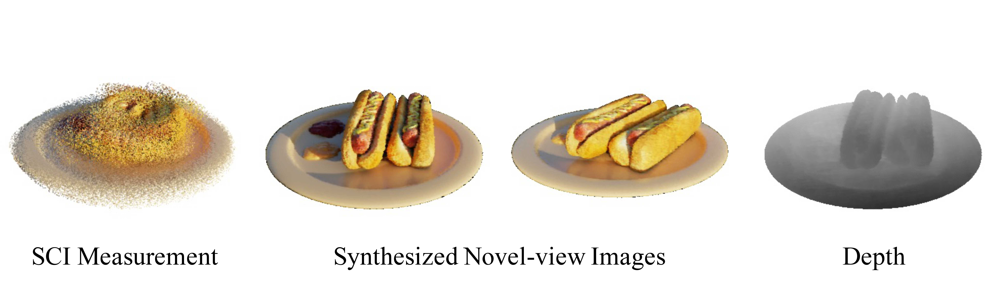
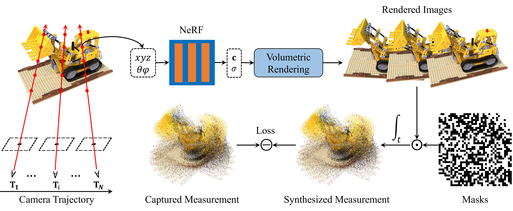

# SCINeRF
[CVPR2024] SCINeRF: Neural Radiance Fields from a Snapshot Compressive Image

.jpg)

This is an official PyTorch implementation of the paper SCINeRF: Neural Radiance Fields from a Snapshot Compressive Image (CVPR 2024). Authors: [Yunhao Li](https://yunhaoli2020.github.io/), Xiaodong Wang, Ping Wang, [Xin Yuan](https://sites.google.com/site/eiexyuan/) and [Peidong Liu](https://ethliup.github.io/).

SCINeRF retrieves the 3D scenes, together with compressed images, from a single temporal-compressed snapshot compressive image.

Codes and Data will be available soon!

## ✨News


⚡ **[2024.02]** Our paper has been accepted by CVPR 2024!

## Novel View Synthesis
 

## Image Restoration Results

## Method overview

When capturing the scene, the snapshot compressive imaging (SCI) camera moves alongside a trajectoy and capture the scene into an SCI measurement.
We follow the real physical image formation process of snapshot compressive imaging (SCI) to synthesize SCI measurement from NeRF. Both NeRF and the motion trajectories are estimated by maximizing the photometric consistency between the synthesized sci measurement and the real measurement.


## Quickstart

### 1. Setup environment

```
git clone git@github.com:WU-CVGL/SCINeRF.git
cd SCINeRF
pip install -r requirements.txt
```

### 2. Download datasets

You can download the data [here](https://drive.google.com/file/d/1V8JN2mtQqR69eg3ct0UxWUUj5qbBOvNY/view?usp=sharing).

Each scene contains an SCI measurement in 'meas.npy', and corresponding masks in 'mask.npy' (in some scenes they are 'mask_25.npy" and 'meas_25.npy").

### 3. Configs

Change the data path and other parameters (if needed) in `configs/cozy2room.txt`. We use *cozy2room* scene as an example.

### 4. Demo with our pre-trained model

You can test our code and render retrieved images from compressed image with the provided checkpoints. To do this, you should first download the checkpoints [here](https://drive.google.com/file/d/1Ko6rNwcatG7RMAVRnHyPVj4EdfzIiwRM/view?usp=sharing), then put the weight file under the corresponding logs folder `./logs/cozy2room`, and then change the parameter `load_weights=True` in `cozy2room.txt`, finally run

```
python train_cacti3.py --config configs/cozy2room.txt
```

### 5. Training

```
python train_cacti3.py --config configs/cozy2room.txt
```

After training, you can get retrieved images from SCI measurement.

## Your own data

`mask.npy`: This file is the binary masks during the SCI imaging process.

`meas.npy`: This file is the SCI measurement, i.e., the compressed image.

Put two files under a folder at  `./data'. Then create a new config file in the `./configs' folder, make sure that the data directory is correct. Finally, modify he h, w, and f parameters, which represents image height, width and focal length of the camera. 


## Acknowledgment

The overall framework, metrics computing and camera transformation are derived from [nerf-pytorch](https://github.com/yenchenlin/nerf-pytorch/) and [BAD-NeRF](https://github.com/WU-CVGL/BAD-NeRF) respectively. We appreciate the effort of the contributors to these repositories.
